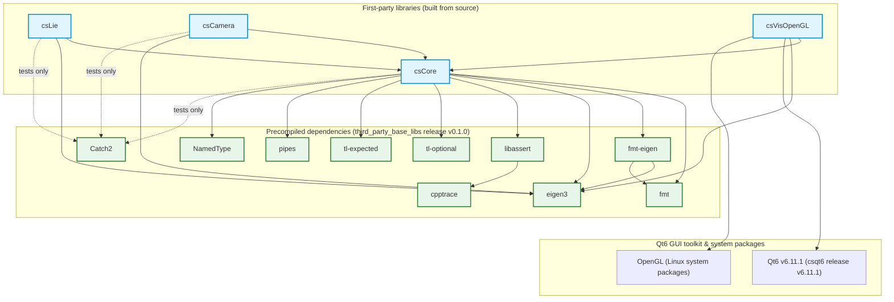

# csfoundation

Automated cross-platform build system and CI pipeline recipe for the **base C++ libraries** (csCMake, csCore, csLie, csCamera, csVisOpenGL) of the cscosine ecosystem, powered by [**csorchestrator**](https://github.com/cscosine/csorchestrator).

---

## Getting Started

### Prerequisites

* Python `>= 3.11`
* Git
* [csorchestrator](https://github.com/cscosine/csorchestrator) cloned as a peer directory (`../csorchestrator`)

### Environment Setup

Bootstrap the local virtual environment, install dev dependencies, link `csorchestrator` in editable mode, and install git hooks:

**Linux / macOS:**
```bash
./setup.sh
source .venv/bin/activate
```

**Windows (PowerShell):**
```powershell
.\setup.ps1
.\.venv\Scripts\Activate.ps1
```

### Running the Orchestrator Locally

Execute the orchestrator script to run pipeline steps locally:

```bash
./csfoundation_project.py
# or
python csfoundation_project.py
```

### Re-generating the GitHub Workflow

To re-generate the GitHub Actions CI workflow (`.github/workflows/csfoundation.yml`) from the definition in [`csfoundation_project.py`](csfoundation_project.py):

```bash
./csfoundation_project.py generate-github-workflow
# or
python csfoundation_project.py generate-github-workflow
```

### Development & Quality Checks

Run linting, static type checking, and test suites:

```bash
# Code formatting and linting
ruff check .
ruff format .

# Strict type checking
python -m mypy . --config-file=pyproject.toml

# Unit tests
pytest

# Run all pre-commit hooks
pre-commit run --all-files
```

---

## Overview

Building the cscosine base C/C++ libraries from source across multiple platforms (Linux and Windows) and architectures (`x64` and `arm64`) can be complex and error-prone. **csfoundation** defines a declarative build and packaging recipe in Python using the `csorchestrator` framework.

With this setup:
- The build pipeline, dependencies, and repository list are defined in Python code.
- Cross-platform CI workflows (e.g. [`.github/workflows/csfoundation.yml`](.github/workflows/csfoundation.yml)) are automatically generated.
- Build artifacts, manifests, and release archives (`.tar.gz` bundles) are assembled consistently across environments.

---

## Architecture & Build Pipeline

The core build recipe is defined in [`csfoundation_project.py`](csfoundation_project.py) and executes across the matrix generated by `csorchestrator`.

### Version Alignment

The project version (`0.1.0`) is defined as `CSFOUNDATION_PROJECT_VERSION` in
[`csfoundation/csorchestrator_config.py`](csfoundation/csorchestrator_config.py) (used by
`create_default_orchestrator(version=...)` in [`csfoundation_project.py`](csfoundation_project.py))
and in [`pyproject.toml`](pyproject.toml) — keep the two aligned when bumping the version.

### Execution Phases

1. **Repos Self Checkout & Update**:
   - Performs a shallow (`depth=1`) self-checkout of this repository so release assembly runs on the runner.
2. **Checkout Repositories**: for every repository configured in [`csfoundation_project.py`](csfoundation_project.py):
   - Clones or pulls the repositories (`csCMake`, `csCore`, `csLie`, `csCamera`, `csVisOpenGL`) into `workspace/<repo>` at the configured ref (usually `dev`).
3. **Install Requirements (Linux-Ubuntu)**:
   - Installs the OpenGL system packages required by the GUI libraries (`libgl1-mesa-dev`, `libopengl-dev`, `mesa-common-dev`) — only when `csVisOpenGL` is among the libraries being built.
4. **Get Precompiled Libraries**:
   - Resolves, transitively and cross-repo, the managed libraries required by the libraries being built (per-release maps `THIRD_PARTY_LIBRARY_DEPENDENCIES` / `QT6_LIBRARY_DEPENDENCIES` in [`csfoundation/csorchestrator_config.py`](csfoundation/csorchestrator_config.py), composed over the first-party edges in `FIRST_PARTY_LIBRARY_DEPENDENCIES`) and downloads only those: the **precompiled third-party libraries** (Catch2, cpptrace, eigen3, fmt, fmt-eigen, libassert, NamedType, pipes, tl-expected, tl-optional) from the [`third_party_base_libs`](https://github.com/cscosine/third_party_base_libs) release and the **Qt6 GUI toolkit** (only when `csVisOpenGL` is built) from the [`csqt6`](https://github.com/cscosine/csqt6) release into `workspace/libs/<variant>`.
   - The full list of precompiled packages and their versions is in the [Dependencies](#dependencies) section.
   - Qt6 archives are mapped onto the build variants (Linux → GCC / Ninja, Windows → MSVC 2022 / Ninja).
5. **Build each library**:
   - Configures, builds, and installs each repository into `workspace/install/<variant>/<repo>` using the per-repository `BuildConfig` (e.g. `DEBUG_RELEASE_RELWITHDEBINFO_PARANOID`).
6. **Get Versions**:
   - Reads each installed library's package version (CMakeConfig package) and writes a per-variant `.csOrchestratorManifest`.
7. **Create Archives**:
   - Packages the installed outputs into per-variant `.tar.gz` archives together with the matching manifest.
8. **Artifacts & Release Bundling**:
   - Uploads per-variant artifacts, then `release-from-artifacts` merges them into a single `csfoundation-<version>.csOrchestratorManifest` and `csfoundation-<version>-bundle.tar.gz` for the GitHub Release.

### Included Libraries

| Repository | BuildConfig |
|---|---|
| csCMake | `None` (checked out, not built) |
| csCore | `DEBUG_RELEASE_RELWITHDEBINFO_PARANOID` |
| csLie | `DEBUG_RELEASE_RELWITHDEBINFO_PARANOID` |
| csCamera | `DEBUG_RELEASE_RELWITHDEBINFO_PARANOID` |
| csVisOpenGL | `DEBUG_RELEASE_RELWITHDEBINFO_PARANOID` |

### Dependencies

`csfoundation` builds all **first-party** libraries (csCore, csLie, csCamera, csVisOpenGL) **from source** and consumes the following precompiled external dependencies (only the ones required by the libraries being built are downloaded; the per-library wiring is `THIRD_PARTY_LIBRARY_DEPENDENCIES` / `QT6_LIBRARY_DEPENDENCIES` in [`csfoundation/csorchestrator_config.py`](csfoundation/csorchestrator_config.py)):

- **third_party_base_libs** — precompiled third-party libraries from its [GitHub release](https://github.com/cscosine/third_party_base_libs):
  - Catch2 (tests of csCore / csLie / csCamera)
  - cpptrace
  - eigen3
  - fmt
  - fmt-eigen
  - libassert
  - NamedType
  - pipes
  - tl-expected
  - tl-optional
- **Qt6** — precompiled GUI toolkit from [csqt6](https://github.com/cscosine/csqt6); required only by `csVisOpenGL`.
- **OpenGL** — Linux system packages (`libgl1-mesa-dev`, `libopengl-dev`, `mesa-common-dev`); required by the GUI libraries and therefore only for `csfoundation`.

### Library Dependency Graph

The graph below captures the **actual compile / link-time dependencies** between the first-party
libraries built here and their precompiled dependencies, derived from each repository's
`CMakeLists.txt` and the installed CMake package configs (`*Config.cmake` / `*Targets.cmake`)
produced by the build.



**Notes:**

- **`csCMake` is intentionally not in the graph**: it is build *tooling* used by every `csCMake`-based repo at **configure time** via `include(csCMake)` (e.g. [`workspace/csCore/CMakeLists.txt`](workspace/csCore/CMakeLists.txt#L5)) — it is checked out but not built, and it is not a runtime / install-time dependency of any installed library.
- **csCore is a *solution* repo**: the first-party libraries consume its components rather than the umbrella target — `csLie`, `csCamera`, and `csVisOpenGL` all link `csCore::core` + `csCore::eigenUtils` (csLie tests additionally use `csCore::math` + `csCore::testUtils`).
- **Qt6 is consumed only by `csVisOpenGL`** (`Core`, `Gui`, `OpenGL`, `Widgets`, `OpenGLWidgets`); the raw `OpenGL` dependency is satisfied by Linux system packages on the Ubuntu runners.
- **`magic_enum` and `tclap` are published in the `third_party_base_libs` release but not referenced by any `cs*` `CMakeLists.txt`** — they are standalone leaf libraries in the third_party_base_libs recipe and ship in its precompiled bundle, but they are **not downloaded** by this recipe since no first-party library requires them.
- `cpptrace` is not linked directly by the `cs*` libraries — it is pulled in statically by `libassert` (see the third_party_base_libs README for the internal 3rd-party dependency graph).
- Compiled vs header-only in this recipe: `csCore` and `csLie` are header-only (`INTERFACE` targets); `csCamera` and `csVisOpenGL` compile static libraries (`STATIC` targets).
- The authoritative list of precompiled packages (third_party_base_libs + csqt6) and their versions is in the **[Dependencies](#dependencies)** section; how they are wired into the first-party builds is shown in the **[Library Dependency Graph](#library-dependency-graph)** below and mirrored in `THIRD_PARTY_LIBRARY_DEPENDENCIES` / `QT6_LIBRARY_DEPENDENCIES` in [`csfoundation/csorchestrator_config.py`](csfoundation/csorchestrator_config.py) (`THIRD_PARTY_TEST_LIBRARY_DEPENDENCIES` holds the test-only Catch2 entries used by CI), which the install helpers use to download only the managed libraries actually required by the libraries being built.

---

## Configuration

### Included Repositories

The repositories built by this project are declared in the `repos` dictionary of
[`csfoundation_project.py`](csfoundation_project.py):

* `csCMake` — checkout-only (`None` build config)
* `csCore`, `csLie`, `csCamera`, `csVisOpenGL` — built with
  `BuildConfig.DEBUG_RELEASE_RELWITHDEBINFO_PARANOID`

### Python Version

The required Python version (`>= 3.11`) is declared in
[`pyproject.toml`](pyproject.toml) and mirrored in the generated CI matrix.

### Orchestrator SDK — csorchestratorsdk

The portable release-manifest helpers are vendored (autogenerated) under
[`csorchestratorsdk/portable/`](csorchestratorsdk/portable/README.md),
synced from **csorchestrator** by running `./csfoundation_project.py generate-github-workflow`.
Do not edit them manually; they let CI runners build the release manifest
without installing the full `csorchestrator` package.

---

## Repository Structure

The repository ships the build recipe plus the **precompiled dependency bundle sources and manifests**
consumed by the pipeline (downloaded libs + their manifests):

```text
csfoundation/
├── csfoundation_project.py                                     # Main orchestrator recipe (entry point)
├── csfoundation/
│   └── csorchestrator_config.py                     # Installs Linux system requirements (apt packages)
├── libs/                                             # Precompiled dependencies downloaded by the recipe
│   ├── third_party_base_libs/                             # third_party_base_libs dependency bundle
│   │   └── csorchestrator_config.py
│   ├── csqt6/                                        # Qt6 GUI toolkit dependency bundle
│   │   └── csorchestrator_config.py
│   └── manifests/                                    # Resolved package manifests (authoritative versions)
│       ├── third_party_base_libs-0.1.0.csOrchestratorManifest
│       └── csqt6-6.11.1.csOrchestratorManifest
├── tests/
│   └── csfoundation/
│       ├── test_csorchestrator_config.py
│       └── test_placeholder.py
├── csorchestratorsdk/portable/                       # [Autogenerated] vendored portable SDK from csorchestrator
├── .agents/skills/
│   └── csfoundation-orchestrator-recipe/SKILL.md        # Agent skill for this repo's recipe
├── .github/workflows/csfoundation.yml                  # Auto-generated CI workflow
├── setup.sh / setup.ps1                              # venv bootstrap scripts
├── open-code.sh / open-code.ps1                      # VS Code launcher scripts
├── pyproject.toml                                    # Project metadata, ruff/mypy/pytest config
└── .pre-commit-config.yaml                           # Pre-commit hooks
```

The **per-variant `.tar.gz` archives and release bundle** (`csfoundation-<version>-bundle.tar.gz`) are
**build-time outputs**, not part of the checked-in tree — they are produced by the CI workflow and
published to the GitHub Release.

---

## CI/CD

The GitHub Actions workflow [`.github/workflows/csfoundation.yml`](.github/workflows/csfoundation.yml)
is **auto-generated** — do not edit it by hand.
Any change to the recipe in [`csfoundation_project.py`](csfoundation_project.py) must be followed by
re-running `./csfoundation_project.py generate-github-workflow` (or `python csfoundation_project.py generate-github-workflow`)
and committing the regenerated file.
